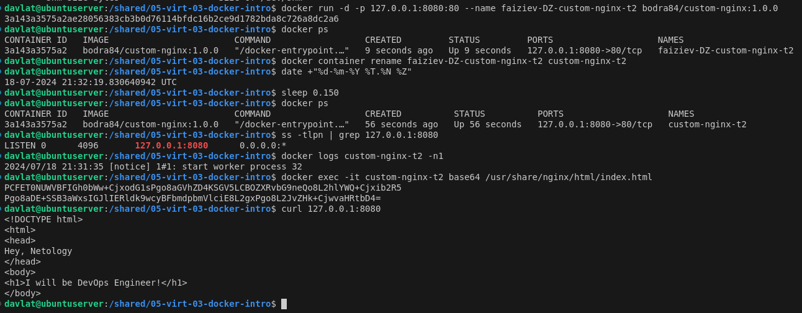
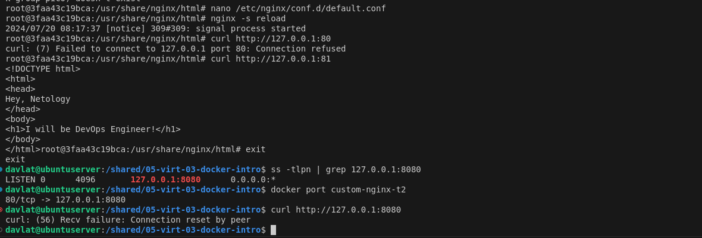
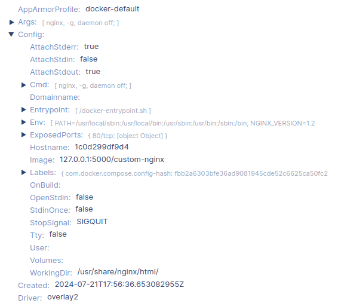
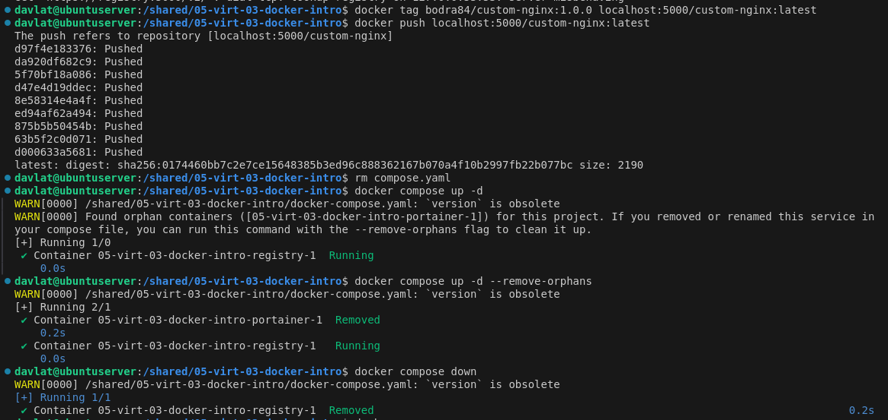
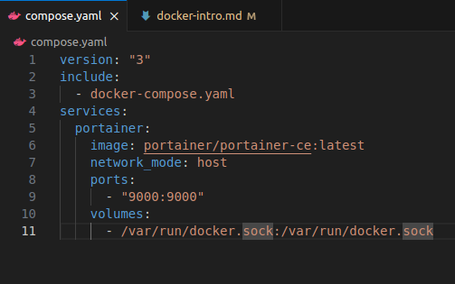

# Домашнее задание к занятию 4 «Оркестрация группой Docker контейнеров на примере Docker Compose»  - Файзиев Давлат
## Задание 1
[Ссылка на решение.](https://hub.docker.com/repository/docker/bodra84/custom-nginx/general)

## Задание 2
Скриншот решения:

## Задание 3
Скриншот решения:
  
  
  
Ответы на вопросы:  
3. Контейнер остановился, потому что данная комбинация клавиш завершает текущий процесс, а в нашем случает это единственный процесс веб-сервера nginx.  
10. Так как у наc мапится порт 80 на 8080, а веб сервер слушает 81 порт, поэтому веб-сервер недоступен.

## Задание 4
Скриншот решения:
 

## Задание 5
Ответы на вопросы: 
1. Был запущен файл compose.yaml, т.к. так должен называтся файл по умолчанию.  
Скриншоты решения:
 
 
 