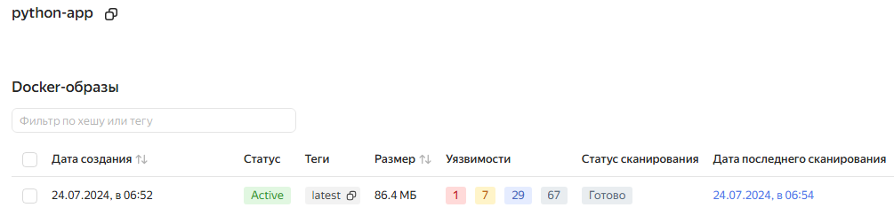
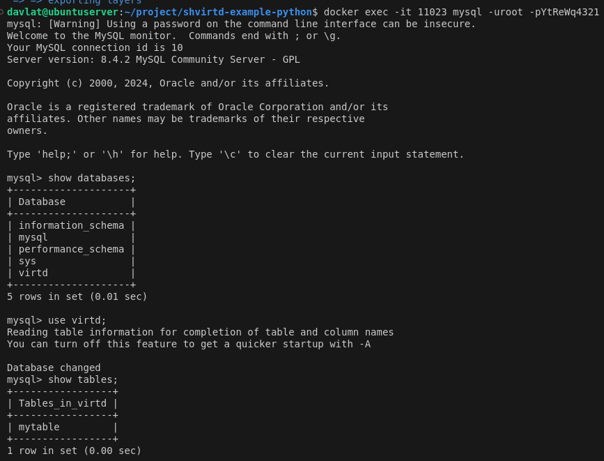
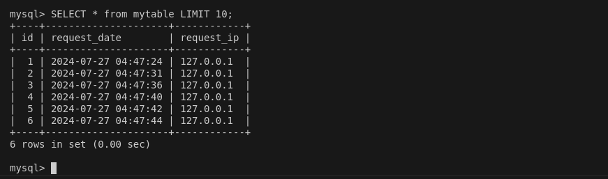
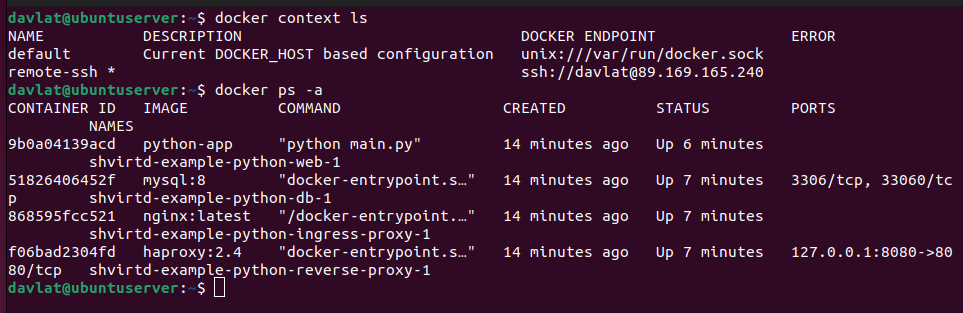

# Домашнее задание к занятию 5. «Практическое применение Docker» - Файзиев Давлат
## Задание 1
см. решение задания 4

## Задание 2
Скриншот решения:

## Задание 3
Скриншот решения:
  
  

## Задание 4
Решение:  
- Скриншот  
 
- bash-скрипт [python-app.sh](file/python-app.sh)
- [Ссылка на репозитарий](https://github.com/bodra84/shvirtd-example-python.git)

